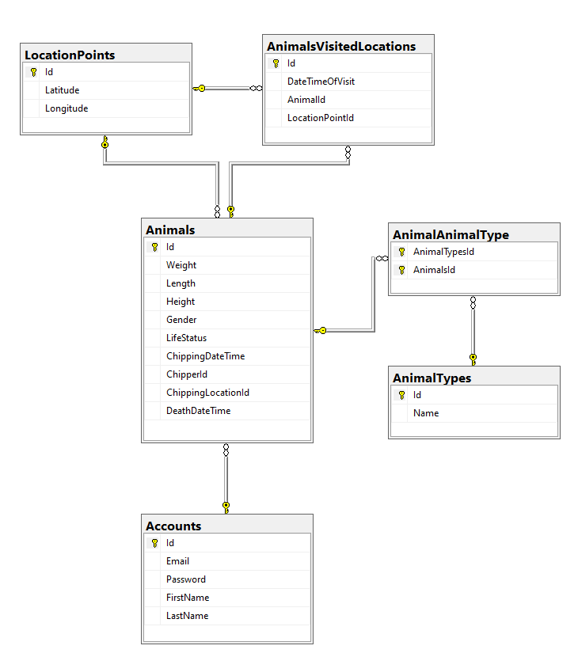
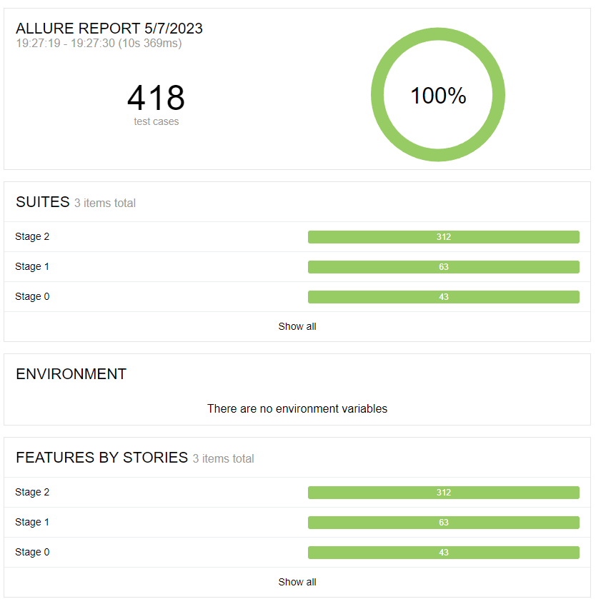
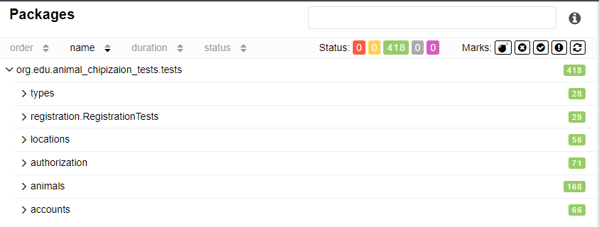

# Legend
> Our company chips animals in a country called 'Wonderland' to track 
> their movements and monitor their health. Tracking the movement of animals is extremely important for protecting them from extinction. 
> This year, the company decided to create a database where previous records will be consolidated 
> for conducting long-term experiments related to animal migration and track changes in their living environments and history

# System functionality
## The system has the following components
 - Account
 - Animal
 - Animal Type
 - Location Point
 - Animal Visited Location
## Controllers should include the following features
 ### Authentication:
 - Account registration
 ### Account:
 - View account info
 - Search/Update/Delete account
 ### Animal:
 - View animal info
 - Create/Search/Update/Delete animals
 - Create/Update/Delete animal type
 ### Animal Type:
 - View animal type info
 - Create/Update/Delete animal type
 ### Location Point:
 - View location point info
 - Create/Update/Delete location point
 ### Animal Visited Location:
 - View information about animal movement
 - Create/Update/Delete animal visited location
## Database Structure
 
## Tests
 
 
